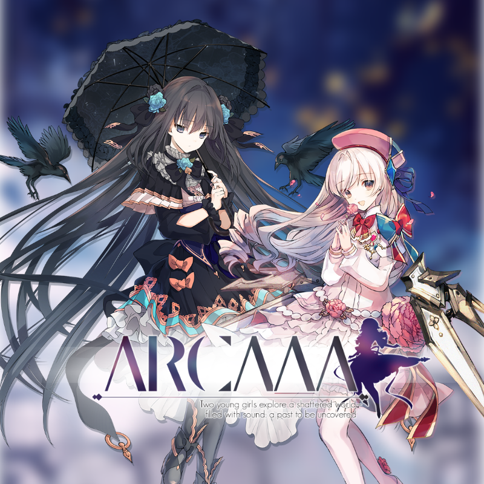

# ArcaaaTools

> Arcaaa是 RedElectricity 组织的sf
>
> 特别感谢: 猫猫(提供伺服器) ['sunset](https://github.com/chinosk114514)(为Arcaaa打包)
>
> 现在Arcaaa十分缺少谱师,加入Arcaaa可以看ChiBot动态



## Arcaaa账号管理

### 绑定账号

```
/aaa bind <ArcaeaID>
```

### 取消绑定账号

```
/aaa unbind
```

## Arcaaa 分数查询

### Arcaaa 最近分数

```
/arc info
```

需要绑定账号

会有点慢，请不要重复查询

## Arcaaa 记忆原点兑换

```
/aaa mmr <记忆原点数量>
```

>  需要先在UserCenter注册账号