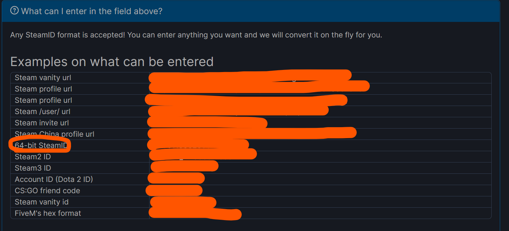

# SteamTools

> 本模块需要Steam 64Bit ID
>
> 获取链接：https://steamdb.info/calculator/
>
> 使用本模块意味着您的头像将会放出来



## Steam 账号操作

### Steam 账号绑定

```
/s-bind <Steam 64bit ID>
```

### Steam 账号解绑

```
/s-unbind
```

## Steam 查看信息

```
/s-info
```

> 需要绑定账号