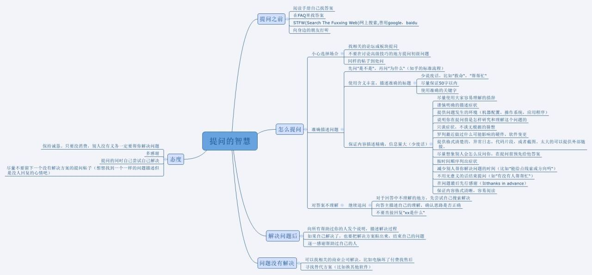

# 反馈

## 须知

1. 由于ChiBot本身是公益型Bot，不会强制收取任何费用，所以ChiBot开发者有权不理你
2. 不然随便乱填表单，不然处理起来很麻烦
3. 社交能力请高一点谢谢（

### 社交能力讲解（

#### 自杀性社交

是指**在社交中，经常性的对他人进行言语上的打击、讽刺，以此来满足个人内心的需求**。这种社交方式最终的结果往往是让所有人讨厌，最终导致自己没有朋友。因此被称为“自杀式社交”。
这种社交方式的经典语录包括：**你不行、我这人说话比较直、我就开个玩笑等**类似的话语。这些话语往往在无形中打击了对话人的积极性和自信心、自尊心。因此，这是一种被大众所讨厌的社交方式。

## 提问的艺术

1. 请描述清楚是有什么问题
2. 请用简介的语言描述

## 表单

http://f5s2tyvlhnh2i35m.mikecrm.com/ikPDTGU